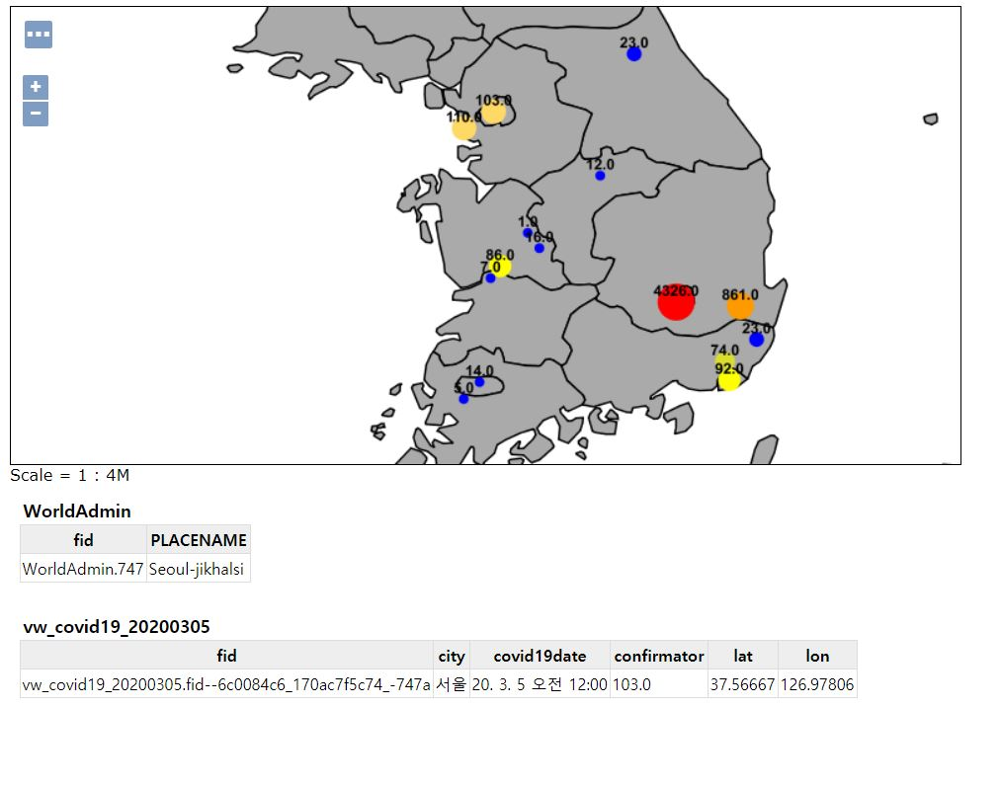

#COVID19 GeoServer

## This Project Provides Information of COVID19-Korea

##Start
GeoServer,Postgresql,PostGIS install & Config Setting

## input sld

## 질병관리본부 데이터 Parsing 및 가공한 csv 생성 후 Postgresql에 import result
### import latlon data table result

### import covid19data table result

### import view(latlon table and covid19data join) result

## GeoServer COVID19 layer result

## GeoServer COVID19 layerGroup result

